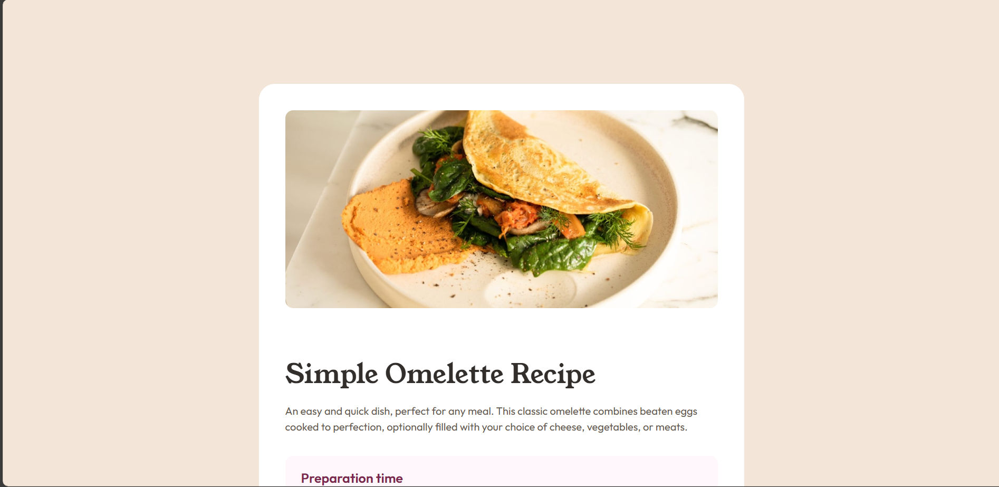

# Frontend Mentor - Recipe page solution

This is a solution to the [Recipe page challenge on Frontend Mentor](https://www.frontendmentor.io/challenges/recipe-page-KiTsR8QQKm). Frontend Mentor challenges help you improve your coding skills by building realistic projects.

## Table of contents

- [Overview](#overview)
  - [The challenge](#the-challenge)
  - [Screenshot](#screenshot)
  - [Links](#links)
- [My process](#my-process)
  - [Built with](#built-with)
  - [What I learned](#what-i-learned)
  - [Continued development](#continued-development)
  - [Useful resources](#useful-resources)
- [Author](#author)
- [Acknowledgments](#acknowledgments)

## Overview

### Screenshot



### Links

- Solution URL: [Github URL](https://github.com/The-Lone-Druid/Recipe-page)
- Live Site URL: [Deployed URL](https://the-lone-druid.github.io/Recipe-page/)

## My process

### Built with

- Semantic HTML5 markup
- CSS custom properties
- Flexbox
- CSS Grid
- Mobile-first workflow
- [Tailwind CSS](https://reactjs.org/) - TailwindCSS CSS Library
- Figma - Designing the layout

### What I learned

- Learned how to use TailwindCSS and it's theme configuration feature
- Learned how to understand the Design System and implement it in the code especially using TailwindCSS theme configuration feature
- Learned how to and when to write custom CSS when required
- Learned complex layouting and flexbox and grid layouting
- Learned how to make responsvie design using TailwindCSS modifiers

```html
<div class="md:p-500">
  
</div>
```

```css
li::marker {
  color: #854632 !important;
  font-weight: bold !important;
}
```

```js
tailwind.config = {
  theme: {
    extend: {
      colors: {
        rose: {
          800: "#7a284e",
          50: "#fff7fb",
        },
      },
    },
  },
};
```

### Continued development

- Will continue making more projects with complex layouts and design, also will move forward to make projects using JavaScript as well

### Useful resources

- [TailwindCSS Documentation](https://tailwindcss.com/docs) - This helped me understand the TailwindCSS and it's features and how to use it in the project. I really liked this pattern and will use it going forward.

## Author

- Website - [Zahid Shaikh](https://www.zahidshaikh.space)
- Frontend Mentor - [@The-Lone-Druid](https://www.frontendmentor.io/profile/The-Lone-Druid)
- Github - [The-Lone-Druid](https://www.github.com/The-Lone-Druid)

**Note: Delete this note and add/remove/edit lines above based on what links you'd like to share.**

## Acknowledgments

- [Frontend Mentor](https://www.frontendmentor.io) - For providing such a great platform to practice and learn new things
